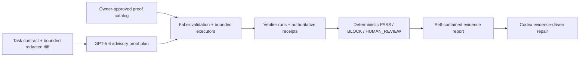

# Faber Proof

**Codex can write the patch. Faber makes the patch prove itself.**

An AI-generated patch can pass every ordinary test and still miss the exact boundary
condition in the task. Faber Proof asks an independent GPT-5.6 planner to turn the task
and bounded diff into falsifiable obligations, executes only repository-approved proof
capabilities, and makes a deterministic evidence-based decision.

```text
                         BAD PATCH   REPAIRED PATCH
Ordinary tests              PASS          PASS
Faber Proof verdict        BLOCK          PASS
```

The original demo catches a scheduler patch that discards a complete report on the
last permitted turn. Faber shows the failed claim and the concrete two-turn
counterexample, Codex makes the narrow ordering repair, and the same proof passes.

## Thirty-second explanation

GPT-5.6 receives a task contract, a bounded redacted diff, and a catalog of proof
templates approved by the repository owner. It returns structured claims and
data-only template selections. It cannot provide commands, source code, imports,
arbitrary paths, or a verdict.

Faber validates every binding, executes the approved capabilities, records verifier
runs and receipts, and returns `PASS`, `BLOCK`, or `HUMAN_REVIEW`. A demonstrated
failure wins over confident prose; missing or stale evidence cannot become `PASS`.

Judges can reproduce the complete bad/repaired comparison without an API key, account,
network request, Docker image, or model provider call.

## Watch the demo

Public narrated video: `HUMAN_GATE::PUBLIC_YOUTUBE_URL`

Status: the recording and public upload require human action. The official submission
deadline has passed, so any Devpost update also requires confirmation that a timely
submission exists or that the organizers authorized a modification.

## Run the no-key proof demo

Python 3.11 or newer and Git are required. From a clean checkout:

Linux/macOS:

```bash
python3 -m venv .venv
. .venv/bin/activate
python -m pip install .
faber doctor
faber demo proof --mode replay --out-dir .faber/build-week-demo
```

Windows PowerShell:

```powershell
py -3.11 -m venv .venv
.\.venv\Scripts\python.exe -m pip install .
.\.venv\Scripts\faber.exe doctor
.\.venv\Scripts\faber.exe demo proof --mode replay --out-dir .faber\build-week-demo
```

Expected comparison:

```text
                         BAD PATCH   REPAIRED PATCH
Ordinary tests              PASS          PASS
Faber Proof verdict        BLOCK          PASS
Failed required claims         1             0
Concrete counterexamples      1             0

Replay provenance: FAKE-DEVELOPMENT
```

The committed fixture is deliberately labeled `fake-development`: replay is a no-key
reproduction of a context-bound structured response, not a new live call and not final
submission provenance. See [the judge quickstart](docs/JUDGE_QUICKSTART.md) for clean
wheel, editable, live-install, digest-validation, and cleanup paths.

## What the blocked report proves

Open these generated files:

```text
.faber/build-week-demo/bad/report.html
.faber/build-week-demo/repaired/report.html
```

The red report places the failed requirement above the fold:

> A complete final report produced on the last permitted turn is preserved and
> returned.

For `turn_budget = 2` and responses `["NOTE: premise", "FINAL: summary"]`, the bad
candidate returns `budget_exhausted` instead of the expected complete
`"premise\nsummary"` report. Ordinary tests remain green because they do not exercise
that exact boundary.

The committed [sample-report provenance gate](examples/build-week-proof/expected/PROVENANCE.md)
explains why final sanitized HTML samples are withheld until the guarded live responses
are human-reviewed. The current reports are valid development evidence for layout,
replay, installation, and deterministic behavior only.

## How it works



The trust boundary is deliberate: task text, repository content, model output, and
replay files are untrusted data. Owner policy defines what may execute. Receipted
evidence, not the model, determines the result.

## Why this is not another AI code reviewer

Generic AI review returns prose, a score, or unrestricted suggested tests. Faber Proof
requires falsifiable claims in a closed proof language and binds every selected
obligation to an approved capability, exact candidate, execution policy, result, and
receipt.

The model can broaden attention; it cannot broaden authority. Unknown templates,
operational-looking fields, replay mismatches, partial bundles, contradictory evidence,
timeouts, and output truncation fail closed.

## GPT-5.6 usage

The optional OpenAI adapter uses the Responses API with strict structured output and
defaults to the `gpt-5.6` alias. The request contains the task, revisions, bounded
redacted diff, mandatory claims, approved catalog, and prompt/schema commitments.

The response contains claims, severity, risk rationale, approved template IDs,
JSON-compatible parameters, coverage links, and uncovered risks. Faber records the
requested and returned model IDs, response ID when available, usage, latency, request
and response digests, and live/replay mode. It does not require private chain-of-thought.

Live mode is guarded and optional. Replay uses the same parser and validator with exact
request, task, diff, catalog, prompt, schema, model, and response-digest bindings.
Current committed responses are deterministic development fixtures, not claimed live
GPT-5.6 output.

## Codex usage and the repository-scoped skill

Codex implemented the Build Week extension through a repository-scoped director queue,
focused work-item commits, adversarial repair loops, and independent audit prompts. The
[`$faber-proof` skill](.agents/skills/faber-proof/SKILL.md) verifies context, runs the
proof, reads the authoritative counterexample, repairs only demonstrated failures, and
reruns the same obligations.

In the demo, Codex moves the complete-report check ahead of the budget-exhaustion
return. It does not rewrite the scheduler or weaken the contract. The primary Codex
session is recorded in the durable Build Week status.

## What existed before Build Week and what was added during Build Week

Faber's provider-neutral protocol, trajectory quality system, verifier receipts, local
runner, source adapters, market records, and training-data foundations predate Build
Week. They are not presented as competition work.

The post-baseline competition extension is Faber Proof: proof protocol and policy,
direct GPT-5.6 planner adapter, context-bound replay, bounded proof catalog and
executors, authority binding, CLI, atomic evidence bundles, self-contained reports,
repository skill, original scheduler demo, guarded live-capture transaction,
adversarial eval campaign, privacy audit, packaging, clean-install audit, and this
submission package.

The annotated baseline is `build-week-2026-baseline` at
`64f775cfe2f622837bd9aaa40f6369aa22af1d80`. The generated
[Build Week delta](docs/generated/BUILD_WEEK_DELTA.md) records every eligible commit
and changed path without claiming pre-existing work as new.

## Technical decisions made by the human entrant

- Build a focused proof-carrying-patch product instead of demoing the broader market.
- Keep the GPT-5.6 integration in a provider adapter rather than the protocol core.
- Make model planning advisory and deterministic verifier receipts authoritative.
- Use bounded repository-approved templates instead of executing generated tests.
- Build an original standard-library demo with no third-party project dependency.
- Preserve a no-key, no-network replay path for judge accessibility.
- Fail closed on missing, stale, contradictory, partial, or unbound evidence.
- Separate pre-existing Faber foundations from the post-baseline competition delta.
- Keep live capture atomic and human-reviewed rather than committing provider output
  automatically.

## Security, privacy, authority, and runtime limitations

Faber binds task, candidate, diff, plan, catalog, selection, workspace, verifier,
result, receipt, and decision digests. It bounds request and process output, rejects
path traversal and symlink escape, stages bundles atomically, emits self-contained
reports, and runs a deterministic privacy scanner over accepted artifacts.

The local runner is not a production sandbox. It provides no
operating-system, VM, container, network, or descendant-process isolation. The scanner
is bounded rather than comprehensive. Repository-owner catalog policy is trusted.
Digests provide integrity, not signatures or non-repudiation. Faber proves declared
obligations, not universal program correctness.

Read the full [Faber Proof threat model](docs/FABER_PROOF_THREAT_MODEL.md).

## Supported platforms and installation paths

- Package requirement: Python 3.11 or newer.
- Declared Build Week workflow: Python 3.11 on Linux and Windows.
- Locally validated checkpoint: Windows with Python 3.11.15.
- macOS: expected from the dependency-light Python path, but not claimed CI-verified.
- Base install: no runtime dependencies and no OpenAI SDK.
- Optional live install: `python -m pip install ".[live-openai]"`.
- Source install: standard wheel/sdist, direct install, or editable development install.

The active Linux/Windows workflow is `.github/workflows/ci.yml`, with a synchronized
reference copy at `codex/build-week/drafts/ci.yml`. GitHub Actions
[run 30217997785](https://github.com/lk251/faber/actions/runs/30217997785) passed on
Ubuntu, Windows, and the optional OpenAI-extra no-provider-call lane.

## Tests, evals, and clean-install evidence

At the completed 0083 machine checkpoint on HB2:

- 710 tests passed and one guarded live test skipped;
- Ruff formatting and lint passed;
- mypy passed across 93 source files;
- 49/49 adversarial cases passed with zero unjustified `PASS` results;
- wheel, sdist, isolated base install, optional live-extra install, installed CLI,
  no-key replay demo, and artifact privacy audit passed;
- four generated reports reproduced byte for byte;
- the latest measured bad/repaired demo completed in 12.207419 seconds on HB2;
- the clean-install package produced 51 demo files, 232,262 bytes, and zero covered
  privacy findings.

The deterministic eval report is
[committed here](docs/generated/BUILD_WEEK_EVAL_RESULTS.md). The generated
[final machine audit](docs/generated/FINAL_SUBMISSION_AUDIT.md) records the current
submission-package checks and unresolved human gates.

## Business and adoption path

The initial buyer is an engineering team that wants to accept more agent-generated code
without pushing all risk onto human review. The practical path is:

1. local Codex skill and CLI for individual maintainers;
2. CI/check integration for engineering teams;
3. repository-approved proof catalogs for repeated task classes;
4. organization policy, audit export, and team reporting;
5. stronger isolated runners and evidence-aware multi-candidate routing;
6. later integration with Faber's verifier market and trajectory system.

There are no claimed customers, revenue, or production deployments.

## Repository map and deeper Faber documentation

- [`src/faber/proofs.py`](src/faber/proofs.py): proof records and fail-closed decision
  policy.
- [`src/faber/proof_planning.py`](src/faber/proof_planning.py): provider-neutral
  planning records.
- [`src/faber/adapters/openai/`](src/faber/adapters/openai/): optional GPT-5.6 live and
  replay adapters.
- [`src/faber/proof_catalog.py`](src/faber/proof_catalog.py): approved bounded
  capabilities.
- [`src/faber/proof_executors.py`](src/faber/proof_executors.py): fixed proof execution
  families.
- [`src/faber/proof_product.py`](src/faber/proof_product.py): local end-to-end workflow
  and atomic bundle validation.
- [`src/faber/proof_reports.py`](src/faber/proof_reports.py): Markdown and self-contained
  HTML reports.
- [`examples/build-week-proof/`](examples/build-week-proof/): original bad/repaired
  scheduler demonstration.
- [`docs/JUDGE_QUICKSTART.md`](docs/JUDGE_QUICKSTART.md): judge installation and replay.
- [`docs/FABER_PROOF_PRODUCT.md`](docs/FABER_PROOF_PRODUCT.md): product and authority
  design.
- [`docs/CODEX_SESSION_HANDOFF.md`](docs/CODEX_SESSION_HANDOFF.md): current operational
  state.
- [`docs/ROADMAP.md`](docs/ROADMAP.md): broader post-freeze Faber direction.

Faber remains a verifier-first, trajectory-first work market underneath this focused
developer-tool entry:

- **Faber for GitHub** is the first source adapter and future GitHub App.
- **Faber Market** coordinates verified work demand and supply.
- **Faber Protocol** is the provider-neutral schema and audit layer.
- **Faber Runner** executes repository-approved verifier policy.
- **Faber Verifiers** represents verifier definitions, evidence, and quality.
- **Faber Orchestration** learns routing from verified trajectories.

GitHub, model providers, payments, and hosted services are adapters rather than root
abstractions.
