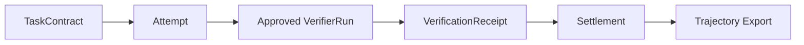

# Golden Path

This walkthrough exercises Faber locally without external services.

```bash
export PYTHONPATH=src
python -m faber.cli init-local-store --path .faber/golden.sqlite3
python -m faber.cli create-demo-contract --store .faber/golden.sqlite3
python -m faber.cli register-demo-worker --store .faber/golden.sqlite3
python -m faber.cli register-demo-verifier --store .faber/golden.sqlite3
python -m faber.cli submit-demo-attempt --store .faber/golden.sqlite3
python -m faber.cli run-demo-verifier --store .faber/golden.sqlite3
python -m faber.cli issue-demo-receipt --store .faber/golden.sqlite3
python -m faber.cli settle-demo --store .faber/golden.sqlite3
python -m faber.cli export-demo-trajectory --store .faber/golden.sqlite3 --out .faber/golden_trajectory.json
```

The shorter demo wrapper runs the same local flow:

```bash
python -m faber.cli run-golden-path --store .faber/golden.sqlite3 --out .faber/golden_trajectory.json
```

The exported trajectory contains the task contract, attempt, authoritative receipt,
settlement, router decision, cost metadata, latency metadata, review metadata, and
learning context.



This is a development path, not hosted Faber. It uses the local SQLite store and
the local runner policy documented in `src/faber/runner/README.md`.
